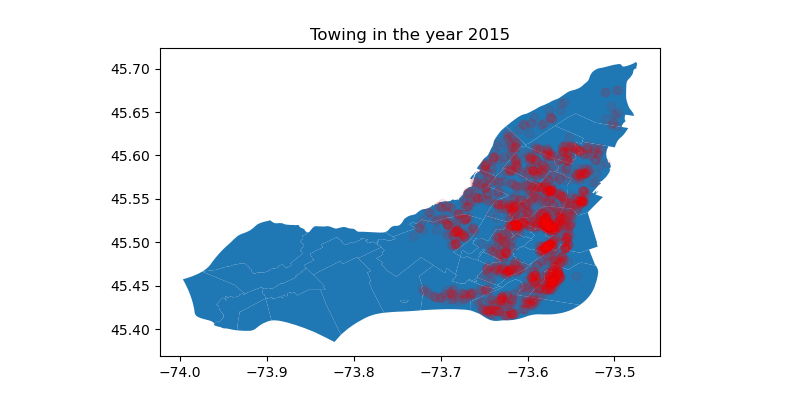

NoToW
==============================

<b>ABSTRACT</b><br>
Parking in Montreal is becoming even more challenging and there is always the risk of getting towed. We have acquired 5 years worth of data that includes a timestamp, geo-coordinate of the origin and destination of the tow and the reason for towing a car in Montreal. Our aim is to predict a real number indicative of the radius within which the probability of finding a towed car is maximum. We also aim to use the parking spots data of the City of Montreal and perform k-means clustering from scratch in dask, to verify if a spot is classified as per its borough.

<br><b>INTRODUCTION</b><br>
<b>Context</b><br>
Montreal is the second-most populous city in Canada and most populous city in the province of Quebec. For over a century and a half, Montreal was the industrial and financial center of Canada because of which Montreal is amongst the top 10 famous cities of Canada [1]. Montreal attracts many local and international travelers and tourists all year round. Some like to travel with their own cars, while some like to rent cars while being in the city.<br>
<b>Objectives</b><br>
Our objective is to minimize the lag between the time a car is towed and the time the owner gets it back. In order to do so, we plan to use supervised learning to train a model that learns how far the cars were placed in the past so that it can predict how far the user can expect their car to be. For the second objective we will be implementing k-means algorithm from scratch in dask and verify the results of the classification.<br>
<b>Presentation of the problem to solve</b><br>
Even though having a car makes it easy to travel around when you are traveling it can turn out to be a bummer if your car gets towed and you have to waste a lot of time getting it back. This experience can be far worse if you are traveling with toddlers. The problem that we want to address is related to the towing of cars. <br>
<b>Related work</b><br>
We plan to first of all clean, preprocess, and sanitize our data. Next, we plan to do some feature engineering by combining this towing data with the weather data on the datetime column, to make it readily consumable by the model. For the supervised learning, the last part would be to train a linear regression model that predicts the radius of the towing destination. In terms of the k-means, we plan to use the standard k-means algorithm but implement each and every step in dask.


<b>MATERIALS AND METHODS</b><br>
<b>Datasets</b><br>
The towing dataset was obtained from the Govt of Canada open data portal website. It contains information from the year 2015-2020 with almost ~250,000 rows of data. We used the following features from the dataset - date_origine, longitude_origine, latitude_origine, longitude_destination, latitude_destination, motif_remorquage. After the clean-up we were left with almost ~200,000 data points for training.<br/>
Our second dataset that was used for the supervised learning task was the weather data. This was also from the Govt of Canada website but it's available in a yearly format. So, we took 6 files for each year ranging from 2015-2020 with 366 rows for each year. The list of features used are - Longitude (x), Latitude (y), Date/Time, Month, Day, Mean Temp (°C), Total Rain (mm), Total Snow (cm), Total Precip (mm).<br/>
We decided to use the data from the City of Montreal for the k-means clustering. It contains the details about all the parking spots on the island of Montreal. This data has 18635 rows one for each of the parking spot in Montreal. Some of the key features used - Snoplace, Nlongitude, Nlatitude.<br>

<b>Technologies</b><br>
We wanted to leverage the methods learned in class to speed up our data cleaning and preprocessing. The first task was to load data into a pyspark dataframe. From there on we went to perform all kinds of operations and benefit from the speedup of parallel processing. The most tricky part was to find the distance between the origin and destination of towing. In order to find that we used the Haversine Formula [Hav], which requires some series of manipulation on coordinates to get the result. This series of manipulation was done using pyspark. Once that was complete, we combined this cleaned and processed towing data with the weather data.
As mentioned before, the k-means clustering was implemented from scratch using dask. <br>

<b>Algorithms</b><br>
Supervised Learning in the aforementioned paragraphs was achieved using LinearRegression package available in the ML-Lib from Pyspark. We processed the data in a format that was consumable by the model and trained it as can be seen in the images below. <br>
For k-means, the first step was to initialize the value of k that we got from our list of boroughs, next we randomly initialized centroids for each parking spot. Then we started the learning process, where for each iteration we would assign centroids to parking spots, calculate how many spots had their centroid changed (this is the stopping condition), depending on this number we would assign these newly calculated centroid to the already existing centroid in the dataframe and repeat the whole process until the number of spots that had their centroids changed was reduced to zero.<br>

|  
|:--:|
*Fig 1:Trainig data for the model* |<br>

| 
| :--: |
*Fig 2: Data that was fed to the model* |

<b>RESULTS</b><br>
<b>Description of Dataset analysis</b><br>
The analysis of the towing data showed us that there was a drastic increase in the number of towing after the from 2015 onwards as can be seen in the following figures - 
| 
|:--:|
*Fig 3: Towings in the year 2015* |<br>

| 
|:--:|
*Fig 4:Towings in the year 2016* |<br>

| 
|:--:|
*Fig 5:Towings in the year 2017* |<br>

| 
|:--:|
*Fig 6:Towings in the year 2018* |<br>

| 
|:--:|
*Fig 7:Towings in the year 2019* |<br>

| 
|:--:|
*Fig 8:Towings in the year 2020* |<br>

The above images show that the data is not very well distributed. It is highly concentrated around the downtown region of Montreal and zero data points in the West part of Montreal. As a result of this fact the learning of our model was also impacted. <br>

Below is the graph that shows the parking spots of Montreal that are controlled by the City of Montreal. One issue we faced was that many close parking spots hindered the visualization of the spots. 

| 
|:--:|
*Fig 9 : Parking spots of the city of Montreal* |<br>

These are the results we obtained after applying our self-implemented dask k-means to the same dataset. We decided to take the sum of squared distance between the coordinates as our distance-measure for the K-means.

| 
|:--:|
*Fig 10: Classification of spots after using k-means dask implementation* |<br>

<b>Description of Implementation</b><br>
With regards to the implementation, we used the cookkie-cutter-data science template. All the raw data used in this project is located in the ```/data/raw/``` directory. Following were the steps that were taken during the project development.
- LinearRegression
    - We started with the preprocessing of the towing data using the scripts located in the ```/src/data/``` directory. The first step is to load the data and change the format of datetime column to make sure the join with weather data is consistent. Output is located in ```/data/interim/towing.data```.
    - Next, we read through each of the weather file, change the column names, and then save them into parquet format in ```/data/interim/weather_year.data``` for quicker reading while training the data.
    - Then comes the feature engineering task where we combine the data from the towing with the weather data by joining on the datetime column and performing some basic cleansing activities like converting string datatype to int. This is saved in the ```/data/processed/cleaned.data``` directory.
    - Since we are using the PySpark ML-Lib library for training, there was an additional step of converting the input and output to vectors using the VectorAssembler from pyspark. Then the data was ready for training and we got the RMSE of 0.32 on training from the trained model. The scrits are located in the ```src/models/train_model.py```
    
    |
    | :--: |
    <i>Fig 12: Weights and intercept of the Linear Regression Model|

- K-means Clusterin
    - Here we take care of the parking spots data. This part is done with Pandas, to facilitate the development process. We take the geojson file that contains Multiploygon objects for all the boroughs of Montreal and associate the geo coordinate of the parking spots with the borough name. A new column names 'Cities' is added to the dataset and in ```/data/interim/spots_with_cities.csv```.
    - No more processing is needed for the k-means. We load the csv file using a dask dataframe and initialize our centroids randomly. Then we start clustering by getting the difference between the current coordinate values and the assigned centroid. We check the number of spots that were re-assigned at each step and repeat this process until we have 0 changes. 
    - Lastly, we plot a graph with the results of the clustered algorithm and log the results from the classification_report module from the scikit learn library. The scrits are located in the ```src/models/predict_model.py```

    |
    | :--: |
    <i>Fig 13: Classification report for the k-means clustering|

<b>DISCUSSION</b><br>
<b>Discussion of solution</b><br>
We obtained a RMSE of 0.32 for our linear regression model. The results are astounding, but we believe that that model did not have enough sound data to learn anything. We were not really sure how the model learned the weights of the model, since it assigns a higher value to the latitude and no weightage to the total_snow feature.<br>
The official website of City of Montreal states that there are 19 boroughs in Montreal, but we used only 12 because out of the 19 boroughs, only 12 of them had parking spots in them that are regulated by the City of Montreal. Since we provided the k=X', we realized that we embeded the prior already in our data before training the k-means, as a result of which it was able to classify them correctly as can be seen in the <i>Fig9</i> and  <i>Fig10</i> above.<br>
<b>Discussion of limitations</b><br>
After obtaining the results we realized that one of the limitation was our data. Not in terms of the amount of data but in terms of the features available in the data, which explains why we had amazing results. Since there was nothing much to learn from the data, there was nothing much to get out of it.<br>
<b>Discussion of possible future work</b><br>
Further exploration of different datasets revealed that data related to the payments made to the parking meter is not revealed by the Government. A request already exists and the message that shows up on the interface says that it is in progress. Supposed we had the data from the parking meters, we would be able to identify when and for how long was a parking spot occupied and vacant. Using this as our prior knowledge we would be able to calculate the probability of towing from a parking spots and classify them as based on this probability. Having this data would also enable us to construct the user-item profile that we would need for a recommender system. This system would then be able to recommend a parking spot to a user given the input parameters. <br>
<br>

___
<br>
<b>PROJECT ORGANIZATION</b>


    ├── LICENSE
    ├── Makefile           <- Makefile with commands like `make data` or `make train`
    ├── README.md          <- The top-level README for developers using this project.
    ├── data
    │   ├── external       <- Data from third party sources.
    │   ├── interim        <- Intermediate data that has been transformed.
    │   ├── processed      <- The final, canonical data sets for modeling.
    │   └── raw            <- The original, immutable data dump.
    │
    ├── docs               <- A default Sphinx project; see sphinx-doc.org for details
    │
    ├── models             <- Trained and serialized models, model predictions, or model summaries
    │
    ├── notebooks          <- Jupyter notebooks. Naming convention is a number (for ordering),
    │                         the creator's initials, and a short `-` delimited description, e.g.
    │                         `1.0-jqp-initial-data-exploration`.
    │
    ├── references         <- Data dictionaries, manuals, and all other explanatory materials.
    │
    ├── reports            <- Generated analysis as HTML, PDF, LaTeX, etc.
    │   └── figures        <- Generated graphics and figures to be used in reporting
    │
    ├── requirements.txt   <- The requirements file for reproducing the analysis environment, e.g.
    │                         generated with `pip freeze > requirements.txt`
    │
    ├── setup.py           <- makes project pip installable (pip install -e .) so src can be imported
    ├── src                <- Source code for use in this project.
    │   ├── __init__.py    <- Makes src a Python module
    │   │
    │   ├── data           <- Scripts to download or generate data
    │   │   └── make_dataset.py
    │   │
    │   ├── features       <- Scripts to turn raw data into features for modeling
    │   │   └── build_features.py
    │   │
    │   ├── models         <- Scripts to train models and then use trained models to make
    │   │   │                 predictions
    │   │   ├── predict_model.py <- Script that trains a K-means classifier
    │   │   └── train_model.py   <- Script that trains a LinearReg
    │   │
    │   └── visualization  <- Scripts to create exploratory and results oriented visualizations
    │       └── visualize.py
    │
    └── tox.ini            <- tox file with settings for running tox; see tox.readthedocs.io


<p><small>Project based on the <a target="_blank" href="https://drivendata.github.io/cookiecutter-data-science/">cookiecutter data science project template</a>. #cookiecutterdatascience</small></p>


---


[1] = https://en.wikipedia.org/wiki/Montreal

[Hav] = https://stackoverflow.com/questions/19412462/getting-distance-between-two-points-based-on-latitude-longitude